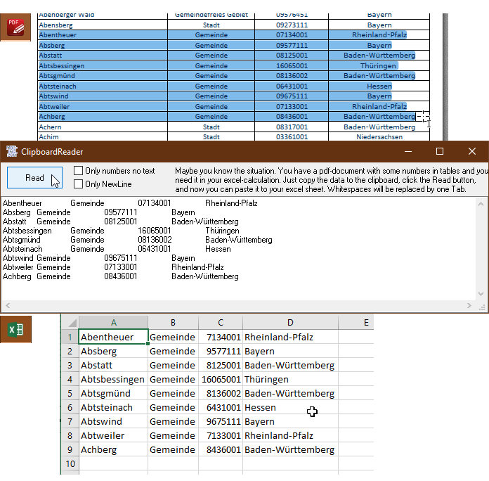

# XL_ClipboardReader  
## How to read data from a pdf in excel through clipboard  

 

Maybe you know the situation. You have a pdf-document with some numbers and data in tables and you need it in your excel-calculation. 
Just copy the data to the clipboard, click the Read button, and now you can paste it to your excel sheet. 
Whitespaces will be replaced by one Tab.  
Project started as Excel Makro around 2004  

 
