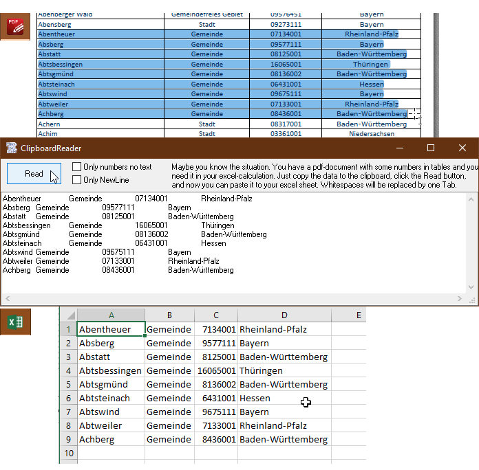

#XL_ClipboardReader
##How to read data from a pdf in excel through clipboard
Maybe you know the situation. You have a pdf-document with some numbers and data in tables and you need it in your excel-calculation. 
Just copy the data to the clipboard, click the Read button, and now you can paste it to your excel sheet. 
Whitespaces will be replaced by one Tab.  

 
